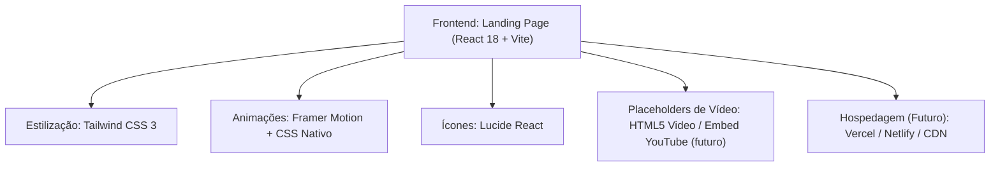

## 1. Desenho da Arquitetura



---

## 2. Descrição das Tecnologias

- **Frontend**: React@18 + TypeScript (tipagem segura)
- **Build Tool**: Vite@5 (rápido, HMR instantâneo)
- **Estilização**: Tailwind CSS@3 (utility-first + design tokens customizados)
- **Animações**: Framer Motion@11 (scroll reveals, staggered animations, micro-interações)
- **Ícones**: Lucide React (ícones lineares consistentes)
- **Fontes**: Google Fonts (Playfair Display + Space Grotesk via next/font ou import direto)
- **Backend**: **Nenhum necessário** — landing page 100% estática
- **Banco de Dados**: Não aplicável
- **Dados**: Mock de conteúdo hardcoded (textos do site original + placeholders de imagem/vídeo)

---

## 3. Definições de Rotas

| Rota | Propósito |
|------|-----------|
| `/` | Landing page única com todas as seções (única rota do projeto) |

Landing page de página única (SPA sem roteamento complexo), navegação interna via âncoras scrolláveis.

---

## 4. Estrutura de Componentes

```
src/
├── components/
│   ├── layout/
│   │   ├── Header.tsx          # Navbar fixa com CTA
│   │   └── Footer.tsx          # Footer com contato + redes
│   ├── sections/
│   │   ├── Hero.tsx            # Hook inicial + CTAs
│   │   ├── CourseIntro.tsx     # O que é o curso / Método Inteligente
│   │   ├── AboutAuthor.tsx     # Sobre o Rômulo Dias
│   │   ├── Testimonials.tsx    # Vídeo depoimento + provas sociais
│   │   ├── Freebies.tsx        # Planilhas gratuitas para download
│   │   ├── FreeLesson.tsx      # Primeira aula gratuita em vídeo
│   │   ├── FAQ.tsx             # Accordion com 5 perguntas frequentes
│   │   └── FinalCTA.tsx        # Último bloco de conversão
│   └── ui/
│       ├── Button.tsx          # Componente de botão reutilizável
│       ├── Card.tsx            # Card glassmorphism base
│       ├── SectionTitle.tsx    # Título de seção com linha decorativa
│       ├── VideoPlayer.tsx     # Placeholder de vídeo
│       └── AccordionItem.tsx   # Item de FAQ
├── hooks/
│   └── useScrollAnimation.ts   # Hook para animações on-scroll
├── data/
│   └── content.ts              # Textos do site original centralizados
├── App.tsx
├── main.tsx
└── index.css                   # Tailwind + custom CSS (variáveis, gradientes)
```

---

## 5. Design Tokens (Tailwind Customização)

```js
// tailwind.config.js - tokens principais
theme: {
  extend: {
    colors: {
      navy: {
        900: '#0B1F3A',   // fundo principal
        800: '#153A66',   // fundo secundário
        700: '#1E4A80',   // cards profundos
      },
      gold: {
        400: '#FFD93D',   // dourado claro
        500: '#FFD700',   // dourado puro
        600: '#F5A623',   // dourado escuro
        700: '#C78B15',   // sombra dourada
      },
      emerald: {
        500: '#10B981',   // vitória / positivo
      }
    },
    fontFamily: {
      display: ['"Playfair Display"', 'serif'],
      sans: ['"Space Grotesk"', 'sans-serif'],
    },
    backgroundImage: {
      'gold-gradient': 'linear-gradient(135deg, #FFD700 0%, #F5A623 100%)',
      'navy-gradient': 'linear-gradient(180deg, #0B1F3A 0%, #153A66 100%)',
    },
    boxShadow: {
      'gold-glow': '0 0 30px rgba(255, 215, 0, 0.35)',
      'card': '0 10px 40px -10px rgba(0,0,0,0.5)',
    },
    backdropBlur: {
      xs: '2px',
    }
  }
}
```

---

## 6. Performance e SEO

- **Estratégia**: Imagens em WebP/AVIF, lazy loading nativo `loading="lazy"`
- **Placeholders de Vídeo**: Thumbnail leve com poster até o clique do usuário
- **Fontes**: `font-display: swap` para não bloquear renderização
- **Animações**: Apenas aceleradas por GPU (transform, opacity)
- **SEO Básico**: Título, meta description, Open Graph, canonical tag, headings semânticos (H1-H3)
