## 1. Visão Geral do Produto

Landing page premium e moderna para o curso online "Método Inteligente" — estratégias e técnicas para aumentar as chances de ganhar na Lotofácil. O site apresenta o autor, o método, conteúdo do curso, depoimento em vídeo, aula gratuita, planilhas de brinde e FAQ completa, com foco em conversão e credibilidade.

- **Público-alvo**: Apostadores da Lotofácil que desejam deixar de perder dinheiro e aprender estratégias matemáticas
- **Valor central**: Transformar jogadores dependentes da sorte em estrategistas que aplicam padrões matemáticos
- **Objetivo de negócio**: Converter visitantes em alunos do curso Método Inteligente

---

## 2. Funcionalidades Principais

### 2.2 Módulos de Funcionalidade
1. **Página Inicial (Landing Page única)**
   - Header fixo com CTA de emergência
   - Hero com hook emocional e CTA principal
   - Seção do curso e proposta de valor
   - Sobre o autor com história pessoal
   - Área de depoimento (vídeo + placeholder para futuros)
   - Seção de brindes: planilhas gratuitas para download
   - Aula 1 gratuita incorporada em vídeo
   - FAQ com accordion interativo
   - CTAs estratégicos ao longo da página
   - Footer com contato e redes sociais

### 2.3 Detalhes da Página

| Página | Módulo | Descrição da Funcionalidade |
|--------|--------|------------------------------|
| Home | Header Fixo | Barra superior com CTA flutuante, WhatsApp e botão de compra fixo no scroll |
| Home | Hero Section | Hook impactante "Já imaginou ganhar na Lotofácil?" com quebra de objeção + botão CTA |
| Home | Proposta do Curso | Descrição completa do Método Inteligente, dores vs soluções, benefícios |
| Home | Sobre o Autor | História do Rômulo Dias, motivação através do pai José Dias, credibilidade desde 2003 |
| Home | Depoimentos | Placeholder de vídeo de depoimento de aluna + cards de "prova social" |
| Home | Brindes / Planilhas | Apresentação das 2 planilhas gratuitas + botão CTA de download |
| Home | Aula Gratuita | Vídeo incorporado "Primeira aula 100% gratuita" |
| Home | FAQ | Accordion interativo com 5 perguntas e respostas completas do site original |
| Home | CTA Final | Última chamada para ação com urgência + botão de compra |
| Home | Footer | Email de contato, links YouTube/Instagram, copyright |

---

## 3. Processo Central

O usuário aterrissa na página → lê o hook da hero → entende a proposta do curso → conhece o autor (credibilidade) → vê depoimento (prova social) → acessa brindes gratuitos (reciprocidade) → assiste aula gratuita → lê FAQ para quebrar objeções → clica no CTA de compra.

```mermaid
flowchart LR
    A["Landing: Usuário acessa"] --> B["Hero: Hook + Quebra de objeção"]
    B --> C["Seção: O que é o Método Inteligente"]
    C --> D["Sobre o Autor: Credibilidade Rômulo"]
    D --> E["Depoimento: Vídeo de aluna"]
    E --> F["Brindes: Planilhas gratuitas"]
    F --> G["Aula 1 Gratuita: Vídeo"]
    G --> H["FAQ: 5 perguntas quebrando objeções"]
    H --> I["CTA Final + Botão de Compra"]
```

---

## 4. Design da Interface do Usuário

### 4.1 Estilo de Design

**Direção Estética**: Luxo / Tecnológico / Premium — fugindo do visual "genérico de infoproduto"

- **Cores**:
  - Primária: Azul meia-noite profundo `#0B1F3A` (confiança, premium)
  - Secundária: Azul petróleo `#153A66` (camadas de profundidade)
  - Destaque / CTA: Gradiente dourado-metálico `#FFD700 → #F5A623` (riqueza, valor, "prêmio")
  - Acento: Verde esmeralda `#10B981` (vitória, confirmação, positivo)
  - Texto: Branco `#FFFFFF` / Cinza claro `#E5E7EB` / Cinza médio `#9CA3AF`
  - Cards: Vidro fosco (glassmorphism) com blur e bordas sutis

- **Botões**:
  - CTA primário: Gradiente dourado com brilho animado, cantos arredondados 14px, sombra luminosa dourada
  - Botão secundário: Borda dourada com fundo transparente, hover preenche com dourado
  - Efeito hover: Elevação + aumento de brilho + micro-scale 1.02

- **Tipografia**:
  - Display/Títulos: `Playfair Display` (serif sofisticado para títulos - elegância e autoridade)
  - Corpo/Textos: `Space Grotesk` (geométrica moderna, ótima legibilidade em telas)
  - Tamanhos: 48-72px h1 hero / 36-48px h2 / 18-20px parágrafos

- **Layout**:
  - Container max 1280px centralizado
  - Seções com respiro generoso (padding 100px+ vertical)
  - Cards glassmorphism organizados em grids assimétricos
  - Elementos decorativos: Linhas douradas finas, blobs coloridos suaves no fundo, partículas sutis
  - Diagonal sutil nas divisórias entre seções

- **Ícones**:
  - Estilo: `Lucide Icons` - lineares finos, com peso 1.5
  - Tratamento: Contorno dourado em ícones de destaque

### 4.2 Resumo de Design por Página

| Página | Módulo | Elementos UI |
|--------|--------|---------------|
| Home | Hero | Fundo gradiente azul profundo + blob dourado, título grande em amarelo, parágrafo justificado, 2 CTAs (dourado primário + contorno) |
| Home | Proposta Curso | 3-4 cards glassmorphism com ícones dos benefícios, texto completo do método |
| Home | Sobre Autor | Layout 2 colunas (imagem/placeholder + texto), timeline sinalizando "desde 2003" |
| Home | Depoimento | Card de vídeo em destaque com sombra dourada, thumbnail com ícone de play animado |
| Home | Brindes | 2 cards de planilhas com ícones Excel/planilha, checkmarks, botão de download |
| Home | Aula Gratuita | Player grande centralizado, destaque "100% Gratuita" com selo |
| Home | FAQ | Accordion com ícone +/- animado, linha dourada entre itens, transição suave |
| Home | CTA Final | Bloco com fundo gradiente dourado sutil, texto urgência, botão gigante |
| Home | Footer | Minimalista, email em destaque, ícones sociais (YouTube/Instagram) |

### 4.3 Responsividade
- **Abordagem**: Desktop-first com breakpoints para tablet (1024px) e mobile (480px / 768px)
- **Mobile**: Layout empilhado, tipografia reduzida (h1 ~36px), CTAs full-width, grids 1 coluna
- **Touch**: Botões com no mínimo 48px de altura, espaçamento entre elementos clicáveis

---

### 4.4 Animações & Micro-interações
- **Entrada**: Staggered fade-in + translate-y a cada seção ao rolar
- **CTA**: Brilho dourado animado percorrendo o botão em loop
- **Cards**: Efeito de flutuação (float) contínuo em cards de destaque
- **Accordion FAQ**: Altura animada + rotação de ícone +/-
- **Scroll suave**: Smooth scroll nativo habilitado
- **Cursor customizado** (opcional em desktop): efeito de círculo seguindo o mouse
